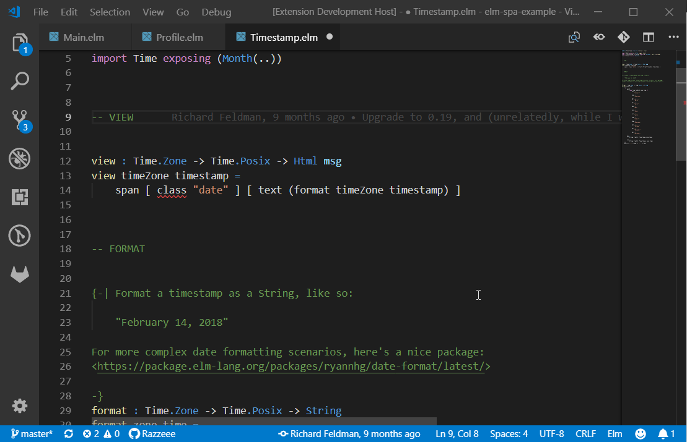

# elm-vscode-ls

This vscode extension is in development and might be lacking features you know working from `vscode-elm`.

## Features

- Diagnostics

## Requirements

You will need to have an executable of this repo on your path https://github.com/elm-tooling/elm-language-server
Just open the repo and follow those instructions, for now. We will prebuild the binarys at a later point in time.

## Extension Settings
This extension contributes the following settings:

* `elmLS.trace.server`: enable/disable trace logging of client and server communication
